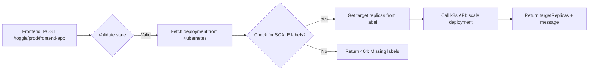

### 📡 **SCALE Backend API (v1)**

_Base URL: `https://your-scale-api/api/v1`_  
_Authentication: Kubernetes RBAC token via `Authorization: Bearer <token>`_

---

### 🔑 **Core Endpoints**

_(All responses use `application/json`)_

---

#### ✅ **1. GET `/api/v1/deployments`**

_Returns ONLY deployments with BOTH `scale.on-replicas` and `scale.off-replicas` labels._  
**No invalid deployments in response.**

```http
GET /api/v1/deployments?namespace=prod
```

**Response (200 OK):**

```json
[
  {
    "namespace": "prod",
    "name": "frontend-app",
    "onReplicas": 5,
    "offReplicas": 0,
    "currentReplicas": 5,
    "labels": {
      "app": "frontend",
      "scale.on-replicas": "5",
      "scale.off-replicas": "0"
    }
  },
  {
    "namespace": "marketing",
    "name": "marketing-campaign",
    "onReplicas": 10,
    "offReplicas": 1,
    "currentReplicas": 1,
    "labels": {
      "app": "marketing",
      "scale.on-replicas": "10",
      "scale.off-replicas": "1"
    }
  }
]
```

**Response (204 No Content):**  
_(When no valid deployments exist)_

```http
HTTP/1.1 204 No Content
```

**Why this matches your workflow:**

- ✅ **Versioned** (`/api/v1/`)
- ✅ **No "missing labels" entries** (filtered at API level)
- ✅ `currentReplicas` = actual state (for UI toggle state)
- ✅ `onReplicas`/`offReplicas` = direct label values (no parsing)

---

#### ✅ **2. POST `/api/v1/toggle/{namespace}/{deployment}`**

_Flips toggle using labels as source of truth._  
**Idempotent and Kubernetes-native.**

```http
POST /api/v1/toggle/prod/frontend-app
Content-Type: application/json

{
  "state": "on"  // "on" or "off"
}
```

**Response (200 OK):**

```json
{
  "namespace": "prod",
  "name": "frontend-app",
  "targetReplicas": 5,
  "currentReplicas": 5,
  "message": "Scaled to 5 replicas"
}
```

**Response (404 Not Found):**  
_(Deployment missing SCALE labels OR not found)_

```json
{
  "error": "Deployment not found or missing SCALE labels"
}
```

**Response (400 Bad Request):**  
_(Invalid state value)_

```json
{
  "error": "Invalid state: 'invalid'. Must be 'on' or 'off'."
}
```

**Why this matches your workflow:**

- ✅ **Versioned endpoint** (`/api/v1/toggle/...`)
- ✅ **Uses labels directly** (no state tracking)
- ✅ `targetReplicas` = from label (no calculation)
- ✅ **Idempotent** (toggling "on" twice → no change)

---

### ⚙️ **Backend Implementation Flow**

_(Matches your Kubernetes workflow exactly)_


